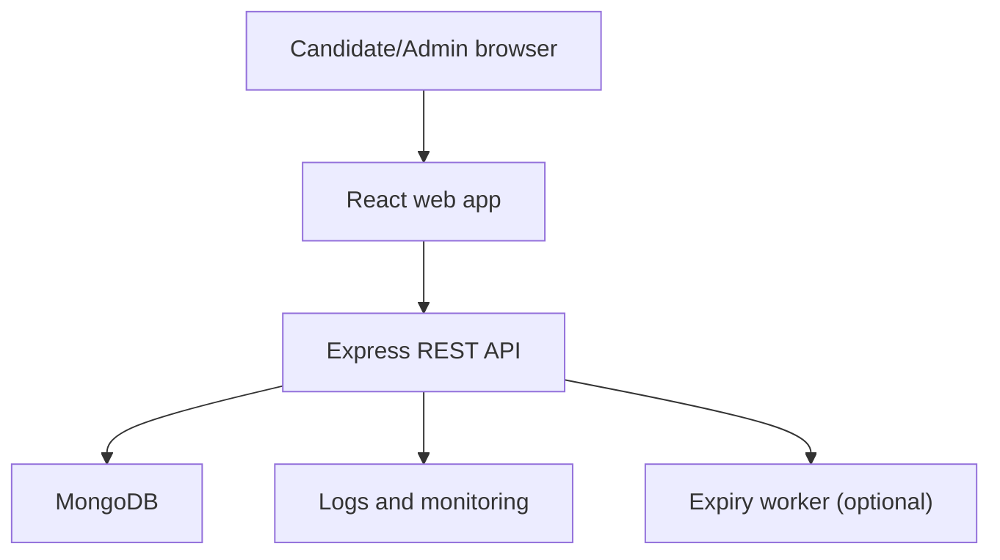
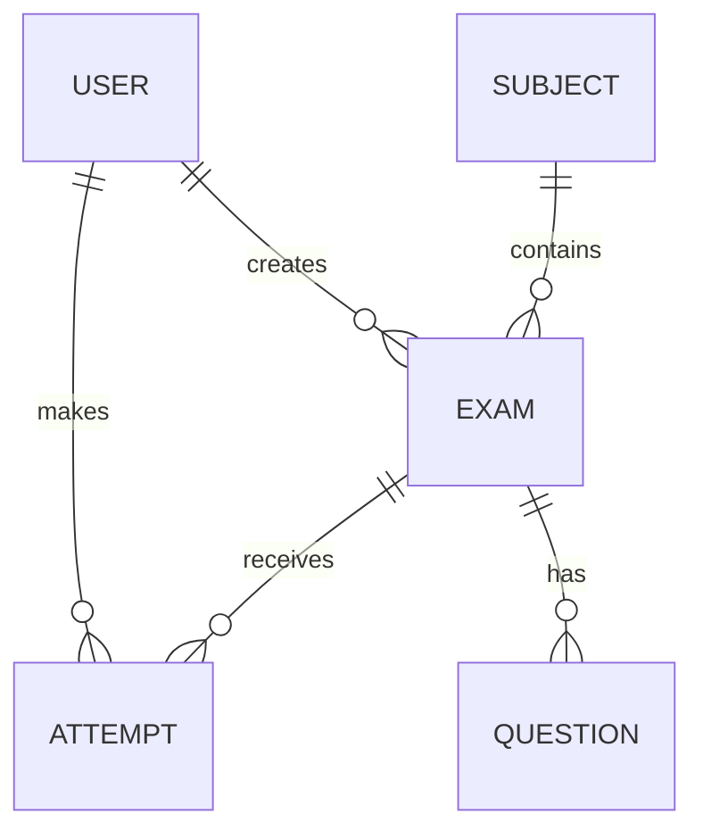
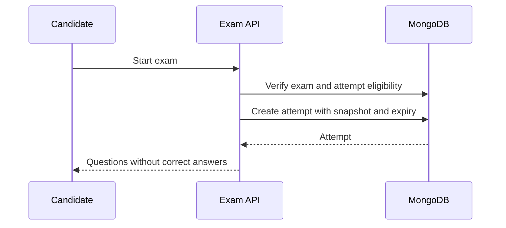
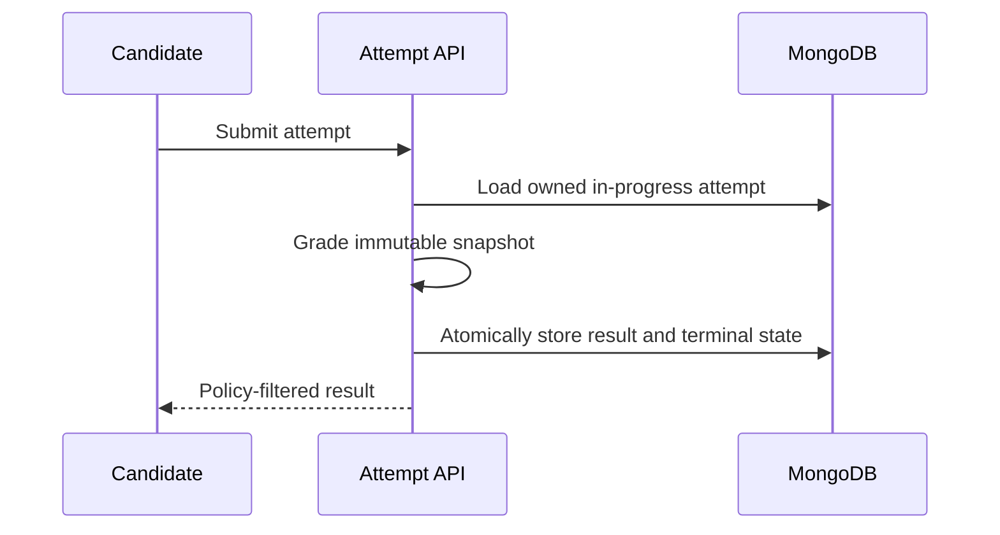

# ExamCenter — System Architecture

**Version:** 1.0  
**Architecture style:** Modular monolith with REST API  
**AI services:** None

## 1. Architecture goals

- Keep the MVP simple enough for one developer to build and deploy.
- Enforce examination rules on the server.
- Isolate correct-answer data from candidate responses.
- Preserve historical result accuracy after exam changes.
- Use clear module boundaries that can be separated later if scale requires it.

## 2. Recommended technology stack

| Layer | Technology | Purpose |
|---|---|---|
| Frontend | React 19, TypeScript, Vite | Candidate and admin web application |
| Routing | React Router | Public, candidate, and admin navigation |
| Server state | TanStack Query | API caching, loading, retries, invalidation |
| Forms | React Hook Form + Zod | Forms and shared validation schemas |
| Styling | Plain CSS with variables/modules | Responsive UI without Tailwind |
| Backend | Node.js, Express, TypeScript | REST API and business rules |
| Database | MongoDB with Mongoose | Users, exams, questions, attempts, results |
| Authentication | JWT access/refresh cookies or server sessions | Identity and role protection |
| Validation | Zod | Request validation and typed data contracts |
| Logging | Pino | Structured application logs |
| Testing | Vitest, Supertest, React Testing Library, Playwright | Unit, API, component, and E2E tests |
| Deployment | Vercel + Render/Railway + MongoDB Atlas | Suggested initial hosting |

The project should not include an AI SDK, model API key, vector database, embeddings, prompts, or AI service module.

## 3. High-level design



The browser handles display and interaction. The API owns authentication, authorization, eligibility, timing, grading, and data visibility. MongoDB stores persistent records. An optional scheduled worker finalizes abandoned expired attempts; requests also apply lazy expiry so correctness does not depend on the worker.

## 4. Repository structure

```text
ExamCenter/
├── docs/
│   ├── PRD.md
│   ├── REQUIREMENTS.md
│   ├── ARCHITECTURE.md
│   ├── UI_UX.md
│   └── DEVELOPMENT_PLAN.md
├── client/
│   ├── src/
│   │   ├── app/
│   │   ├── components/
│   │   ├── features/
│   │   │   ├── auth/
│   │   │   ├── subjects/
│   │   │   ├── exams/
│   │   │   ├── attempts/
│   │   │   └── admin/
│   │   ├── layouts/
│   │   ├── pages/
│   │   ├── services/
│   │   ├── styles/
│   │   └── types/
│   └── package.json
├── server/
│   ├── src/
│   │   ├── config/
│   │   ├── modules/
│   │   │   ├── auth/
│   │   │   ├── users/
│   │   │   ├── subjects/
│   │   │   ├── exams/
│   │   │   ├── questions/
│   │   │   ├── attempts/
│   │   │   └── reports/
│   │   ├── middleware/
│   │   ├── shared/
│   │   ├── app.ts
│   │   └── server.ts
│   ├── tests/
│   └── package.json
├── shared/
│   └── contracts/
├── .env.example
├── package.json
└── README.md
```

Each backend module should normally contain model/schema, validation, repository, service, controller, route, and tests. Controllers translate HTTP requests; services own business rules; repositories/models perform data access.

## 5. Domain model

### User

```ts
type User = {
  id: string;
  name: string;
  email: string;
  passwordHash: string;
  role: "candidate" | "admin";
  status: "active" | "disabled";
  createdAt: Date;
  updatedAt: Date;
};
```

### Subject

```ts
type Subject = {
  id: string;
  name: string;
  slug: string;
  description?: string;
  isActive: boolean;
  createdBy: string;
  createdAt: Date;
  updatedAt: Date;
};
```

### Exam

```ts
type Exam = {
  id: string;
  subjectId: string;
  title: string;
  slug: string;
  description?: string;
  instructions: string;
  durationMinutes: number;
  passingPercentage: number;
  attemptLimit: number;
  availableFrom?: Date;
  availableUntil?: Date;
  shuffleQuestions: boolean;
  shuffleOptions: boolean;
  showScoreAfterSubmit: boolean;
  showAnswersAfterSubmit: boolean;
  status: "draft" | "published" | "archived";
  version: number;
  createdBy: string;
  publishedAt?: Date;
  createdAt: Date;
  updatedAt: Date;
};
```

### Question

```ts
type Question = {
  id: string;
  examId: string;
  text: string;
  type: "single_choice";
  options: Array<{ id: string; text: string }>;
  correctOptionId: string;
  explanation?: string;
  marks: number;
  negativeMarks: number;
  order: number;
  createdAt: Date;
  updatedAt: Date;
};
```

### Attempt

```ts
type Attempt = {
  id: string;
  examId: string;
  examVersion: number;
  userId: string;
  sequenceNumber: number;
  status: "in_progress" | "submitted" | "expired";
  startedAt: Date;
  expiresAt: Date;
  submittedAt?: Date;
  snapshot: {
    title: string;
    passingPercentage: number;
    questions: Array<{
      questionId: string;
      text: string;
      options: Array<{ id: string; text: string }>;
      correctOptionId: string;
      marks: number;
      negativeMarks: number;
      order: number;
    }>;
  };
  answers: Array<{
    questionId: string;
    selectedOptionId?: string;
    isFlagged: boolean;
    savedAt: Date;
  }>;
  result?: {
    score: number;
    maximumMarks: number;
    percentage: number;
    passed: boolean;
    correctCount: number;
    incorrectCount: number;
    unansweredCount: number;
  };
  createdAt: Date;
  updatedAt: Date;
};
```

For a small-to-medium MVP, embedding the attempt snapshot and answers makes historical grading reliable and retrieval simple. If exams become extremely large, snapshots can be moved to a separate versioned collection.

## 6. Data relationships and indexes



Recommended indexes:

- `users.email`: unique.
- `subjects.slug`: unique; `subjects.name` normalized unique.
- `exams.slug`: unique or compound unique by subject.
- `exams.subjectId + status + availableFrom + availableUntil`: catalogue filtering.
- `questions.examId + order`: unique compound index.
- `attempts.userId + examId + sequenceNumber`: unique compound index.
- `attempts.examId + status + submittedAt`: admin reporting.
- A partial unique index on `attempts.userId + examId` where status is `in_progress`, if supported by the chosen schema strategy.

## 7. API design

Base path: `/api/v1`

### Authentication and profile

| Method | Endpoint | Role | Purpose |
|---|---|---|---|
| POST | `/auth/register` | Public | Register candidate |
| POST | `/auth/login` | Public | Sign in |
| POST | `/auth/refresh` | Public/cookie | Refresh session |
| POST | `/auth/logout` | Authenticated | End session |
| GET | `/users/me` | Authenticated | Get profile |
| PATCH | `/users/me` | Authenticated | Update profile |

### Candidate catalogue and attempts

| Method | Endpoint | Role | Purpose |
|---|---|---|---|
| GET | `/subjects` | Candidate | List active subjects |
| GET | `/exams` | Candidate | List/filter visible exams |
| GET | `/exams/:examId` | Candidate | Get details and eligibility |
| POST | `/exams/:examId/attempts` | Candidate | Start or resume attempt |
| GET | `/attempts/:attemptId` | Owner | Get active attempt safely |
| PUT | `/attempts/:attemptId/answers/:questionId` | Owner | Save/clear answer and flag |
| POST | `/attempts/:attemptId/submit` | Owner | Submit idempotently |
| GET | `/attempts` | Candidate | List own history |
| GET | `/attempts/:attemptId/result` | Owner | Get policy-filtered result |

### Admin

| Method | Endpoint | Role | Purpose |
|---|---|---|---|
| GET/POST | `/admin/subjects` | Admin | List/create subjects |
| PATCH | `/admin/subjects/:id` | Admin | Update subject |
| GET/POST | `/admin/exams` | Admin | List/create exams |
| GET/PATCH | `/admin/exams/:id` | Admin | Read/update exam |
| POST | `/admin/exams/:id/publish` | Admin | Validate and publish |
| POST | `/admin/exams/:id/unpublish` | Admin | Return to draft safely |
| POST | `/admin/exams/:id/archive` | Admin | Archive exam |
| GET/POST | `/admin/exams/:id/questions` | Admin | List/add questions |
| PATCH/DELETE | `/admin/questions/:id` | Admin | Update/remove question |
| PUT | `/admin/exams/:id/questions/order` | Admin | Reorder questions |
| GET | `/admin/exams/:id/attempts` | Admin | Paginated attempt report |
| GET | `/admin/dashboard` | Admin | Summary metrics |

### Standard response and error format

```json
{
  "success": false,
  "error": {
    "code": "EXAM_ATTEMPT_LIMIT_REACHED",
    "message": "You have used all allowed attempts.",
    "details": null,
    "requestId": "request-id"
  }
}
```

Use stable machine-readable codes. Do not expose stack traces or database details.

## 8. Critical request flows

### Start attempt



The start operation should run in a transaction when the deployment supports it. A unique active-attempt constraint protects against simultaneous start requests.

### Submit and grade



If the attempt is already terminal, the endpoint returns its existing result. This makes retries safe.

## 9. Correct-answer isolation

This is the most important data-boundary rule.

- Create separate DTO/serializer functions for admin questions, active candidate questions, and completed review questions.
- Never use a raw Mongoose question or attempt document in a candidate response.
- Exclude `snapshot.questions.correctOptionId` and any correctness calculation from active-attempt projections.
- Do not store correct answers in frontend state, HTML attributes, source maps, or local storage.
- Add automated tests that recursively inspect candidate payloads for forbidden keys such as `correctOptionId` and `isCorrect`.
- Return answer review only after terminal state and only when policy permits.

## 10. Time and expiry strategy

- `expiresAt = startedAt + snapshotted duration` is calculated by the server.
- Every attempt read, answer save, and submission checks current server time.
- The UI displays `expiresAt` and periodically corrects its countdown using `serverNow` from API responses.
- On expiry, the server atomically grades saved answers and marks the attempt `expired`.
- An optional minute-based job finalizes abandoned expired attempts for reporting, but request-time checks remain mandatory.

## 11. Authentication recommendation

Use short-lived access tokens and rotating refresh tokens in secure HTTP-only cookies, or use server-side sessions. Avoid storing long-lived authentication tokens in `localStorage`. Authorization middleware sequence:

1. Authenticate session/token.
2. Confirm active user.
3. Enforce required role.
4. In the service, verify resource ownership or admin scope.

## 12. Grading service

The grading function should be pure and deterministic:

```ts
grade(snapshotQuestions, savedAnswers, passingPercentage) => result
```

It should not read current questions from the database. Tests must cover all-correct, all-wrong, all-unanswered, mixed answers, negative marking, floating-point rounding, duplicate/unknown option input rejection, and exact pass threshold.

## 13. Concurrency and consistency

- Answer save is an upsert keyed by question ID within the owned active attempt.
- Submit uses an atomic conditional update where status is `in_progress`.
- Repeated submit returns the stored terminal result.
- Published exam validation and state change occur together.
- Use optimistic concurrency/version fields for admin edits.
- Question reorder validates the complete set of question IDs in one request.

## 14. Security controls

- Zod schemas on all request bodies, query parameters, and path IDs.
- Helmet, strict CORS allowlist, payload size limits, and rate limiting.
- Password hashing and refresh-token rotation/revocation.
- MongoDB query sanitization and explicit field selection.
- CSRF protection when cookie authentication is used.
- Object-level authorization for attempts.
- Generic authentication errors to prevent account enumeration.
- Dependency scanning, secret scanning, and production HTTPS.

## 15. Observability

- Structured logs with request ID, route, status, duration, user ID when allowed, and error code.
- Metrics: request latency/error rate, login failures, started/submitted/expired attempts, grading failures, and active attempts.
- Error monitoring for unhandled exceptions.
- Audit records for publish, unpublish, archive, and role changes.

## 16. Deployment environments

| Environment | Purpose |
|---|---|
| Local | Developer machine with local or development database |
| Test/CI | Automated isolated test database |
| Staging | Production-like manual and E2E verification |
| Production | Public application with HTTPS, backups, monitoring, and restricted database access |

Suggested production topology: Vercel for the React client, Render/Railway for the Express API, and MongoDB Atlas. A single-host deployment is also valid if HTTPS, process supervision, backups, and secret management are configured.

## 17. Environment variables

```dotenv
NODE_ENV=development
PORT=5000
MONGODB_URI=
CLIENT_ORIGIN=http://localhost:5173
JWT_ACCESS_SECRET=
JWT_REFRESH_SECRET=
ACCESS_TOKEN_TTL=15m
REFRESH_TOKEN_TTL=7d
LOG_LEVEL=info
```

There is deliberately no AI API key or model configuration.

